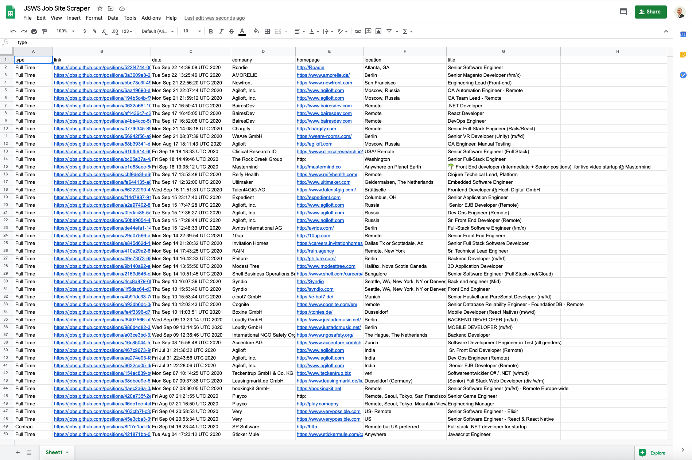

# JS-JobScraping
An application for scraping job searches from the GitHub jobs api using Javascript.

## Skills applied
- Extracting and storing api data in datebases
- Knowledge of working with Google cloud platform services
- ES6 JavaScript

## Features 

The Functionality will fetch all related jobs listed over as many pages as have entries matching the query and displays on a google sheets document.

